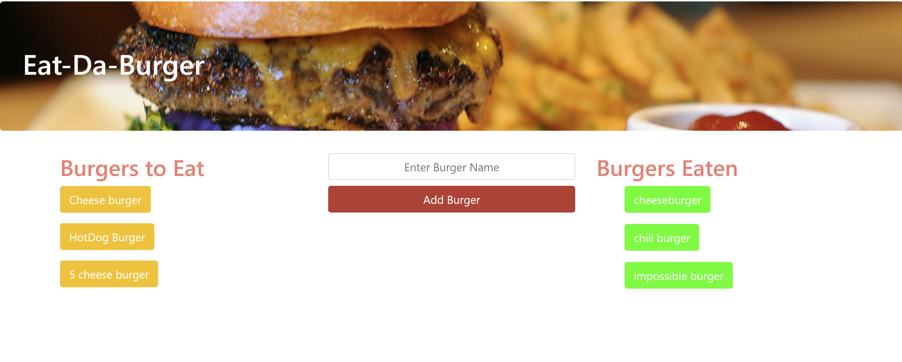

# BurgerEatingApp
A burger logger created with MySQL, Node, Express, Handlebars and a homemade ORM, following the MVC design pattern.  Add a burger to the list, Click to "eat it," then click to delete it from the "Eaten list."

# **BurgerEatingApp**

#### *Created By Charles Price, (cfprice3)*
#### email: cfprice3@gmail.com
#### git url: https://github.com/cfprice3
#### application url: https://cfprice3.github.io/BurgerEatingApp/

### *Project Description:*
This is a Fun "Burger Creator/Eating" application using node, express, express handlebars, and SQL to build a simple add and update database application.

 ## **Table of Contents**
 1. Installation
 2. Usage
 3. License
 4. Contributing
 5. Questions

### **1. Installations:**
A requirement for using this README.md generator template is installing the "express," "mysql," and "express handlebars" npm packages.

Open the terminal and type "npm init" to create a package JSON file.  Next, type "npm install express", "npm install mysql", and "npm install express-handlebars" to download the needed packages.

### **2. Usage:**
After installing the npm packages, in your terminal command line type "node server.js". The server will load onto PORT 3000.  You can then type a burger name in the form box, click add, and it will appear on the list on the left.  Then you can click the Created burger name, to "eat it" and it will then appear on the right column as eaten.

### **3. License:**
["MIT", "APACHE 2.0", "GPL 3.0", "BSD 3", "None"]

### **4. How you can contribute:**
Any styling or formatting contributions are welcome!

### **5. Questions:**
Please feel free to ask or add any questions!